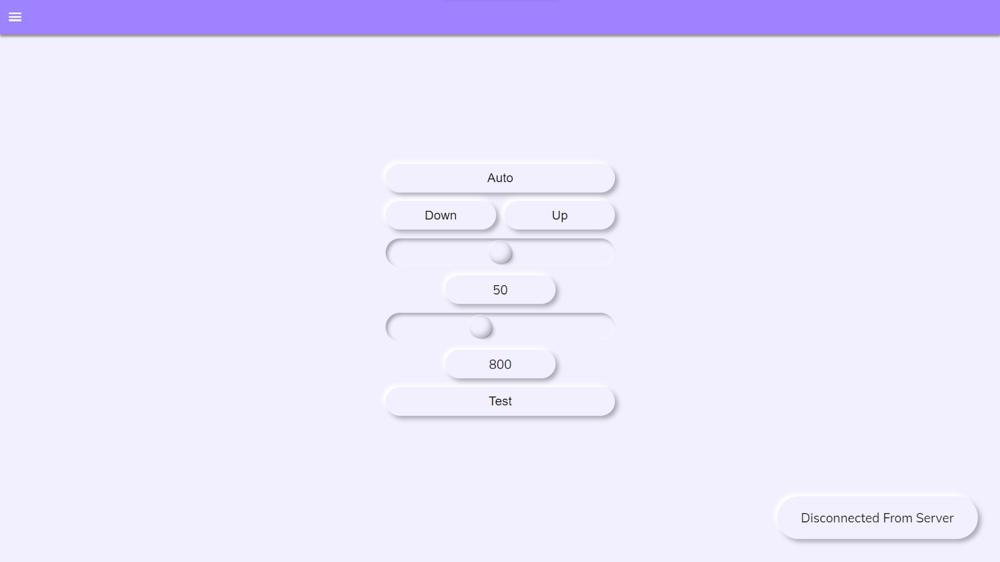
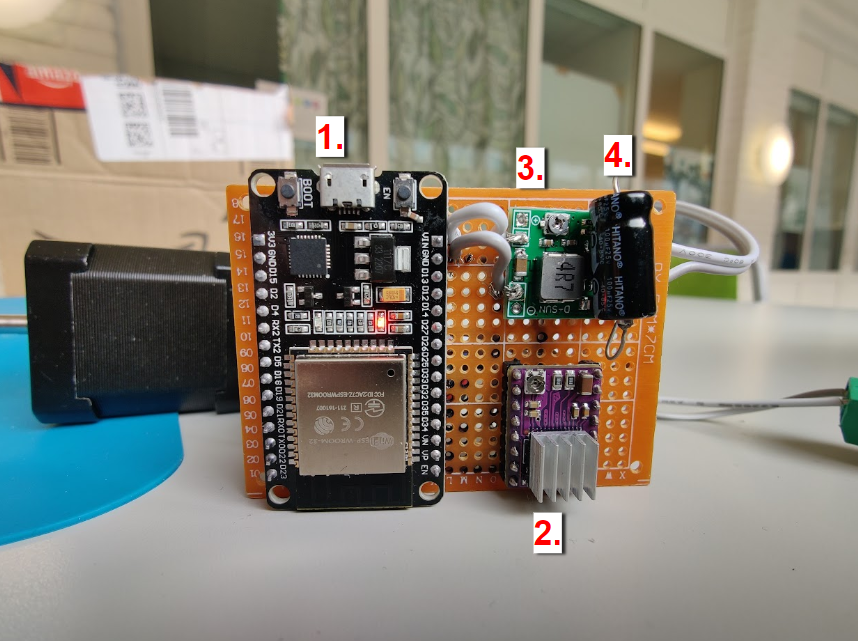
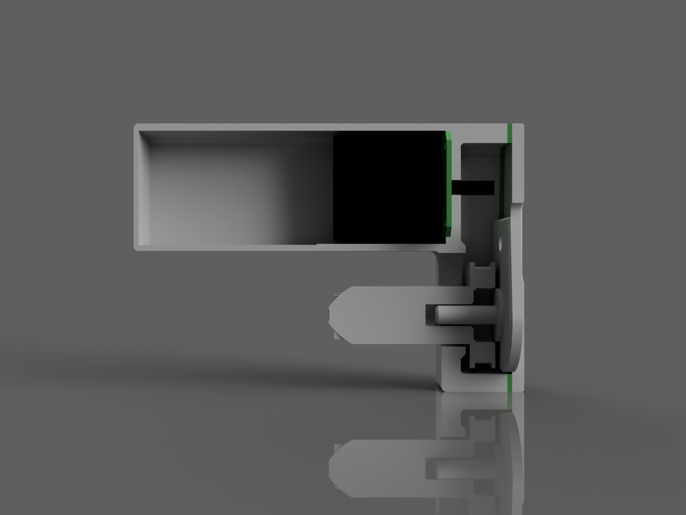
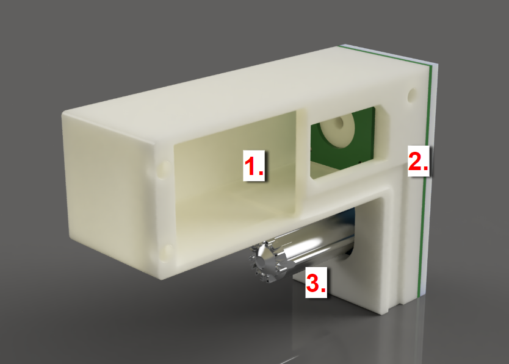

# Rullgardin Gymnasiearbete

## Utdrag ur projektrapporten

Arbetet utformas av flera olika sammanhängande delar; det finns inget uppenbart optimalt tillvägagångssätt. Det är som en kedja, med flera olika länkar. Det spelar inte någon roll hur eller i vilken ordning man skapar länkarna, men först när man är klar så kan man koppla ihop dem. Vi kan dela upp de olika länkarna i delar: webbgränssnittet, själva utseendet på hemsidan; ett chip – för att fånga upp signaler från gränssnittet – som sitter vid rullgardinen; och den mekaniska delen, motorn och det som händer med rörelsen som den skapar, som får själva rullgardinen att röra på sig. Arbetsmetoden för arbetet är nästan separat för dessa fyra delar. 
Arbetet inleddes där användarupplevelsen startar, webbgränssnittet. Gränssnittet skrevs med HTML och CSS i Visual Studio Code. Målsättningen var att skapa en sida med ett smidigt och intelligent upplägg, med tydliga funktioner. Koden för gränssnittet skapades med kreativt inflytande från diverse föregångare på internet, och med trial-and-error-metod.

Bild 1: En skärmdump av webbgränssnittet

Bild 2: Ett kretskort som används för att ta emot och distribuera signaler från gränssnittet

1. ESP32 är namnet på det WiFi-chip som driver användargränssnittet och bestämmer när och hur snabbt motorn ska rotera.
2. Motorkontroll-chip som tar emot instruktionerna från ESP32 och omvandlar dem till signaler som får motorn att röra sig.
3. Transformatorn omvandlar spänningen från 12 V till 5 V som är vad ESP32 använder. Detta gör att vi enbart behöver en strömkälla, trots att komponenterna drivs med två olika spänningar. 
4. Kondensatorn säkerställer en stabil strömnivå även när motorn kräver mer energi, framförallt precis när den ska börja snurra. Den kan liknas med ett litet batteri som lagrar energin till då den behövs mest. 

Bild 3: Genomskärning av höljet med de mekaniska komponenterna

Bild 4: En rendering av chassit och adaptern
(160 mm x 112 mm x 56 mm)

En signal går från kretskortet till en 12-volts stegmotor, som driver rullgardinen. Motorn roterar ett kugghjul, som är kopplat med en rem till en större adapter med  storleksförhållandet 4:1 mot kugghjulet. Till motorn, remmen, och adaptern, har vi skapat ett chassi (se bild 2). I chassit finns det rum för motorn och ett utfyllande hölje (1) som är till för att motverka buller på grund av tomrum i chassit. Sidan av chassit är ägnat till kugghjulet och remmen (2). Ett hål har modellerats där adaptern (3) sticker ut och fästs i rullgardinen. Adaptern är fäst i ett kullager, som i sin tur är fäst i chassit, så adaptern kan rotera fritt.
Chassit, adaptern, och kugghjulen är skapade med en 3D-skrivare. Det är en metod som såklart förutsätter att man har tillgång till en sådan, men har fördelarna gentemot en manuell verkstadsproduktion att tillverkningen är billigare, enklare, och att resultatet blir mer detaljerat. 
